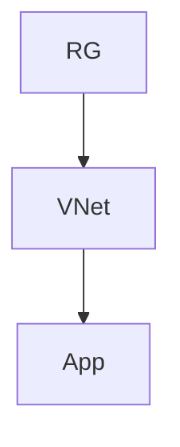

# Workload Documentation Standards

## Visual Styling

**MANDATORY**: All documentation MUST follow the styling standards in:

📚 **[Azure Artifacts Skill](../skills/azure-artifacts/SKILL.md)**

Key requirements:

- Use GitHub callouts (`> [!NOTE]`, `> [!TIP]`, `> [!WARNING]`, etc.)
- Include status emoji for progress indicators (✅ ⚠️ ❌)
- Use category icons for resource sections (💻 💾 🌐 🔐 📊)
- Add collapsible `<details>` sections for lengthy content
- Include `## References` section with Microsoft Learn links at document bottom

---

## Document Purpose

- **Customer deliverables** for consulting engagements
- **Operational reference** for day-2 operations
- **Compliance evidence** for audits
- **Knowledge preservation** for maintainability

---

## Source Artifacts

### Required Sources

| Source              | Location                        | Extract                         |
| ------------------- | ------------------------------- | ------------------------------- |
| WAF Assessment      | `02-architecture-assessment.md` | Business context, pillar scores |
| Cost Estimate       | `03-des-cost-estimate.md`       | Monthly costs, SKU rationale    |
| Implementation Plan | `04-implementation-plan.md`     | Resource specs, dependencies    |
| Bicep Code          | `infra/bicep/{project}/`        | Resource definitions            |

### Integration Rules

1. **Reference, don't duplicate** - Link to existing documents
2. **Extract and summarize** - Pull key data points
3. **IaC is source of truth** - Resource details from Bicep

---

## Output Files

| File                        | Purpose                   | Required |
| --------------------------- | ------------------------- | -------- |
| `07-documentation-index.md` | Master index              | Yes      |
| `07-design-document.md`     | 10-section design doc     | Yes      |
| `07-operations-runbook.md`  | Day-2 procedures          | Yes      |
| `07-resource-inventory.md`  | Resource listing from IaC | Yes      |
| `07-compliance-matrix.md`   | Security controls         | Optional |
| `07-backup-dr-plan.md`      | DR procedures             | Optional |

---

## Design Document (10 Sections)

| Section                  | Content                                          |
| ------------------------ | ------------------------------------------------ |
| 1. Introduction          | Purpose, objectives, stakeholders                |
| 2. Architecture Overview | Diagram, subscription org, regions, naming, tags |
| 3. Networking            | VNets, subnets, NSGs, DNS                        |
| 4. Storage               | Accounts, encryption, access                     |
| 5. Compute               | App Services, VMs, scaling                       |
| 6. Identity & Access     | Auth, RBAC, managed identities                   |
| 7. Security & Compliance | Baseline, policies                               |
| 8. Backup & DR           | Strategy, RTO/RPO                                |
| 9. Monitoring            | Log Analytics, alerts                            |
| 10. Appendix             | Inventory, IPs, NSG rules, cost                  |

---

## Operations Runbook Structure

- **Quick Reference** - Region, RG, contacts
- **Daily Operations** - Health checks
- **Maintenance** - Weekly/monthly tasks
- **Incident Response** - Severity, resolution
- **Scaling** - Scale up/down procedures
- **Deployment** - Standard, emergency, rollback

---

## Resource Inventory Structure

````markdown
## Summary

| Category   | Count |
| ---------- | ----- |
| Compute    | X     |
| Storage    | X     |
| Networking | X     |

## Resources

| Name   | Type   | SKU   | Location |
| ------ | ------ | ----- | -------- |
| {name} | {type} | {sku} | {region} |

## Dependencies


````

```

---

## Quality Checklist

- [ ] All 10 design sections populated
- [ ] Resource inventory matches Bicep
- [ ] Diagrams referenced (not duplicated)
- [ ] ADRs linked appropriately
- [ ] Cost estimate referenced
- [ ] Operations runbook actionable
- [ ] Dependencies mapped
```
