# Step 1: Requirements - {project-name}

<strong>📑 Table of Contents</strong>

- [Project Overview](#project-overview)
- [Functional Requirements](#functional-requirements)
- [Non-Functional Requirements (NFRs)](#non-functional-requirements-nfrs)
- [Compliance & Security Requirements](#compliance--security-requirements)
- [Budget](#budget)
- [Operational Requirements](#operational-requirements)
- [Regional Preferences](#regional-preferences)
- [Summary for Architecture Assessment](#summary-for-architecture-assessment)
- [References](#references)

> Generated by @requirements agent | {date}

| ⬅️ Previous | 📑 Index | Next ➡️ |
| --- | --- | --- |
| — | [README](README.md) | [02-architecture-assessment.md](02-architecture-assessment.md) |

## Project Overview

| Field | Value |
| ----- | ----- |
| **Project Name** | {project-name} |
| **Project Type** | {Static Site / API Backend / Full-Stack / Data Platform} |
| **Timeline** | {Start date} → {Target go-live} |
| **Primary Stakeholder** | {name / role} |
| **Business Context** | {one-line summary} |

### Business Context

Capture the business context gathered during Phase 1 discovery:

| Field | Value |
| ----- | ----- |
| Industry / Vertical | {Retail, Healthcare, Financial Services, etc.} |
| Company Size | {Startup, Mid-Market, Enterprise} |
| Current State | {Greenfield / Migration / Modernization / Extension} |
| Migration Source | {On-prem, other cloud, legacy platform — or N/A if greenfield} |
| Business Drivers | {Why this project? Cost savings, growth, compliance, etc.} |
| Success Criteria | {How will business success be measured?} |

### State Transition

```mermaid
flowchart LR
    A["🏢 Current State<br/>{current-state}"] -->|"Migration Path"| B["☁️ Desired State<br/>{desired-state}"]
    B --> C["✅ Success Criteria<br/>{success-criteria}"]
```

## Functional Requirements

### Core Capabilities

| # | Capability | Priority | Acceptance Criteria |
| - | ---------- | -------- | ------------------- |
| 1 | {capability} | 🔴 Must / 🟡 Should / 🟢 Could | {measurable criterion} |
| 2 | {capability} | 🔴 Must / 🟡 Should / 🟢 Could | {measurable criterion} |

### User Types

| User Type | Description | Est. Count | Access Level |
| --------- | ----------- | ---------- | ------------ |
| {type} | {description} | {count} | {Admin / Contributor / Reader} |

### Integrations

| System | Direction | Protocol | Auth Method | SLA |
| ------ | --------- | -------- | ----------- | --- |
| {system} | Inbound / Outbound / Bidirectional | REST / gRPC / Event | {OAuth / API Key / MI} | {SLA} |

### Data Types

| Category | Sensitivity | Est. Volume | Retention | Residency |
| -------- | ----------- | ----------- | --------- | --------- |
| {category} | 🔴 High / 🟡 Medium / 🟢 Low | {volume} | {period} | {region} |

### Architecture Pattern

| Field | Value |
| ----- | ----- |
| Workload Pattern | {Static Site / N-Tier / API-First / Serverless / Data} |
| Recommended Option | {Option from Service Recommendation Matrix} |
| Tier | {Cost-Optimized / Balanced / Enterprise} |
| Justification | {Why this pattern fits the requirements} |

## Non-Functional Requirements (NFRs)

| WAF Pillar | Metric | Target | Current | Gap |
| ---------- | ------ | ------ | ------- | --- |
| 🔄 Reliability | SLA | {target %} | {current or N/A} | {gap} |
| 🔄 Reliability | RTO | {target} | {current or N/A} | {gap} |
| 🔄 Reliability | RPO | {target} | {current or N/A} | {gap} |
| ⚡ Performance | Page Load | {target ms} | {current or N/A} | {gap} |
| ⚡ Performance | API Response (p95) | {target ms} | {current or N/A} | {gap} |
| ⚡ Performance | Concurrent Users | {target} | {current or N/A} | {gap} |
| 🔒 Security | Auth Method | {MFA / SSO / Certificate} | — | — |
| 🔒 Security | Encryption | {At-rest + In-transit} | — | — |
| 💰 Cost | Monthly Budget | {amount} | — | — |
| 🔧 Operations | Uptime Monitoring | {Yes / No} | — | — |

### Scalability

| Dimension | Current | 6-Month Projection | 12-Month Projection |
| --------- | ------- | ------------------ | ------------------- |
| Users | {count} | {count} | {count} |
| Data Volume | {size} | {size} | {size} |
| Transactions/day | {count} | {count} | {count} |

## Compliance & Security Requirements

### Regulatory Frameworks

<strong>PCI-DSS</strong> — {Applicable / Not Applicable}

| Requirement | Applicability | Notes |
| ----------- | ------------- | ----- |
| Cardholder data storage | {Yes / No} | {details} |
| Network segmentation | {Yes / No} | {details} |
| Encryption requirements | {Yes / No} | {details} |

<strong>SOC 2</strong> — {Applicable / Not Applicable}

| Trust Principle | Applicability | Notes |
| --------------- | ------------- | ----- |
| Security | {Yes / No} | {details} |
| Availability | {Yes / No} | {details} |
| Confidentiality | {Yes / No} | {details} |

<strong>HIPAA</strong> — {Applicable / Not Applicable}

| Requirement | Applicability | Notes |
| ----------- | ------------- | ----- |
| PHI handling | {Yes / No} | {details} |
| BAA required | {Yes / No} | {details} |
| Audit logging | {Yes / No} | {details} |

<strong>GDPR</strong> — {Applicable / Not Applicable}

| Requirement | Applicability | Notes |
| ----------- | ------------- | ----- |
| EU data subjects | {Yes / No} | {details} |
| Data residency | {Yes / No} | {details} |
| Right to erasure | {Yes / No} | {details} |

<strong>ISO 27001</strong> — {Applicable / Not Applicable}

| Control Area | Applicability | Notes |
| ------------ | ------------- | ----- |
| Access control | {Yes / No} | {details} |
| Asset management | {Yes / No} | {details} |
| Incident management | {Yes / No} | {details} |

### Data Residency

| Requirement | Value |
| ----------- | ----- |
| Primary Region | {region} |
| Data Sovereignty | {EU-only / No restriction / Country-specific} |
| Cross-region Replication | {Required / Not required} |

### Authentication & Authorization

| Requirement | Value |
| ----------- | ----- |
| Identity Provider | {Entra ID / B2C / External IdP} |
| MFA Requirement | {Required / Conditional / Not required} |
| RBAC Model | {Azure RBAC / Custom / Application-level} |

### Network Security

| Control | Required | Notes |
| ------- | -------- | ----- |
| Private endpoints | ✅ / ❌ | {details} |
| VNet integration | ✅ / ❌ | {details} |
| Public endpoints acceptable | ✅ / ❌ | {details} |
| WAF required | ✅ / ❌ | {details} |

### Recommended Security Controls

Table of recommended controls based on workload pattern and compliance requirements:

| Control                | Recommended | User Confirmed | Notes                    |
| ---------------------- | ----------- | -------------- | ------------------------ |
| Managed Identity       | {yes/no}    | {yes/no}       | {Prefer over keys}       |
| Private Endpoints      | {yes/no}    | {yes/no}       | {For data services}      |
| WAF                    | {yes/no}    | {yes/no}       | {For public endpoints}   |
| Key Vault for Secrets  | {yes/no}    | {yes/no}       | {Centralized secrets}    |
| Diagnostic Settings    | {yes/no}    | {yes/no}       | {Audit logging}          |
| TLS 1.2 Minimum        | {yes/no}    | {yes/no}       | {Always recommended}     |
| Encryption at Rest     | {yes/no}    | {yes/no}       | {Platform default}       |
| Network Isolation      | {yes/no}    | {yes/no}       | {VNet/NSG/Private Link}  |

## Budget

> [!NOTE]
> The Azure Pricing MCP server generates detailed cost estimates during
> architecture assessment (Step 2). Provide an approximate budget here.

| Field | Value |
| ----- | ----- |
| 💰 Monthly Budget | {approximate amount, e.g., ~$50} |
| 📅 Annual Budget | {optional — monthly × 12 if not specified} |
| 🚦 Limit Type | {🔴 Hard = cannot exceed / 🟡 Soft = can negotiate} |
| 📊 Cost Model Pref | {Consumption / Committed / Hybrid} |

### Cost Optimization Priorities

| Priority | Selected | Impact |
| -------- | -------- | ------ |
| Minimize compute costs | ☐ | {High / Medium / Low} |
| Prefer consumption-based pricing | ☐ | {High / Medium / Low} |
| Reserved instances acceptable | ☐ | {High / Medium / Low} |
| Spot instances for non-critical | ☐ | {High / Medium / Low} |

## Operational Requirements

### Monitoring & Alerting

| Capability | Required | Tool / Service | Notes |
| ---------- | -------- | -------------- | ----- |
| Application monitoring | ✅ / ❌ | Application Insights | {details} |
| Log aggregation | ✅ / ❌ | Log Analytics | {details} |
| Alert notifications | ✅ / ❌ | {Email / Teams / PagerDuty} | {recipients} |
| Custom dashboards | ✅ / ❌ | Azure Monitor / Grafana | {details} |

### Support & Maintenance

| Requirement | Value |
| ----------- | ----- |
| Support Hours | {24/7 / Business hours / Best-effort} |
| On-call Requirement | {Yes / No} |
| Maintenance Windows | {Day / Time / Frequency} |
| Change Management | {Formal CAB / Team approval / Self-service} |

### Backup & Disaster Recovery

| Component | Backup Frequency | Retention | Recovery Method |
| --------- | ---------------- | --------- | --------------- |
| {component} | {Daily / Hourly / Continuous} | {30d / 90d / 1yr} | {Automated / Manual} |

## Regional Preferences

| Preference | Value | Justification |
| ---------- | ----- | ------------- |
| Primary Region | swedencentral | {default — override if required} |
| Failover Region | {region or N/A} | {compliance / latency / cost} |
| Availability Zones | {Required / Preferred / Not needed} | {SLA / cost trade-off} |

---

## Summary for Architecture Assessment

### Handoff Summary

| Aspect | Key Points |
| ------ | ---------- |
| Critical Constraints | {top 3 constraints driving architecture} |
| Key Decisions | {decisions made during requirements that affect architecture} |
| Open Risks | {unresolved items that architect must address} |
| Recommended Pattern | {workload pattern from Functional Requirements} |
| Budget Envelope | {monthly budget from Budget section} |

### Requirements Completeness

| Section | Status | Notes |
| ------- | ------ | ----- |
| Project Overview | ✅ / ⚠️ / ❌ | {notes} |
| Functional Requirements | ✅ / ⚠️ / ❌ | {notes} |
| NFRs | ✅ / ⚠️ / ❌ | {notes} |
| Compliance & Security | ✅ / ⚠️ / ❌ | {notes} |
| Budget | ✅ / ⚠️ / ❌ | {notes} |
| Operational Requirements | ✅ / ⚠️ / ❌ | {notes} |

---

## References

> [!NOTE]
> 📚 The following Microsoft Learn resources provide additional guidance.

| Topic                      | Link                                                                                                |
| -------------------------- | --------------------------------------------------------------------------------------------------- |
| Well-Architected Framework | [Overview](https://learn.microsoft.com/azure/well-architected/)                                     |
| Azure Regions              | [Products by Region](https://azure.microsoft.com/explore/global-infrastructure/products-by-region/) |
| Compliance Offerings       | [Azure Compliance](https://learn.microsoft.com/azure/compliance/)                                   |

---

_Requirements captured using [plan-requirements.prompt.md](../../.github/prompts/plan-requirements.prompt.md) template_

---

| ⬅️ — | 🏠 [Project Index](README.md) | ➡️ [02-architecture-assessment.md](02-architecture-assessment.md) |
| --- | --- | --- |
