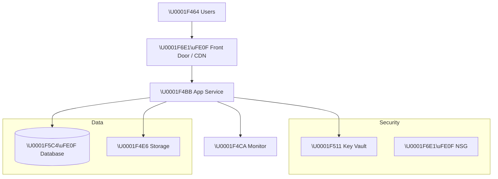
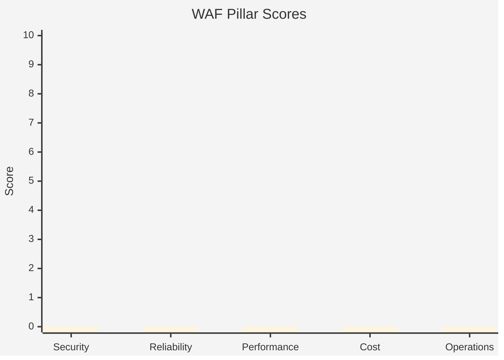

# Step 2: Architecture Assessment - {project-name}

<strong>📑 Table of Contents</strong>

- [Requirements Validation ✅](#requirements-validation-)
- [Executive Summary](#executive-summary)
- [WAF Pillar Assessment](#waf-pillar-assessment)
- [Resource SKU Recommendations](#resource-sku-recommendations)
- [Architecture Decision Summary](#architecture-decision-summary)
- [Implementation Handoff](#implementation-handoff)
- [Approval Gate](#approval-gate)
- [References](#references)

> Generated by architect agent | {date}

| ⬅️ Previous | 📑 Index | Next ➡️ |
| --- | --- | --- |
| [01-requirements.md](01-requirements.md) | [README](README.md) | [03-des-cost-estimate.md](03-des-cost-estimate.md) |

## Requirements Validation ✅

| Requirement Area | Status | Validation Notes |
| ---------------- | ------ | ---------------- |
| NFRs (SLA, RTO, RPO) | ✅ Defined / ⚠️ Partial / ❌ Missing | {notes} |
| Compliance requirements | ✅ Defined / ⚠️ Partial / ❌ Missing | {notes} |
| Budget (approximate) | ✅ Defined / ⚠️ Partial / ❌ Missing | {notes} |
| Scale requirements | ✅ Defined / ⚠️ Partial / ❌ Missing | {notes} |
| Security controls | ✅ Defined / ⚠️ Partial / ❌ Missing | {notes} |
| Data residency | ✅ Defined / ⚠️ Partial / ❌ Missing | {notes} |

> [!WARNING]
> Any ❌ items above must be resolved before proceeding to implementation.

---

## Executive Summary

Brief narrative summary of the workload and recommended approach.

### Recommended Architecture

> Replace the above with actual architecture for the project.

---

## WAF Pillar Assessment

### Overall Scores

| Pillar | Score | Confidence | Summary |
| ------ | ----- | ---------- | ------- |
| 🔒 Security | /10 | High / Med / Low | |
| 🔄 Reliability | /10 | High / Med / Low | |
| ⚡ Performance | /10 | High / Med / Low | |
| 💰 Cost Optimization | /10 | High / Med / Low | |
| 🔧 Operational Excellence | /10 | High / Med / Low | |

**Primary Pillar Optimized**: {pillar}
**Trade-offs Accepted**: {trade-offs}

> Replace bar values with actual pillar scores.

---

### 🔒 Security Assessment ({score}/10)

**Strengths:**

- List strengths

**Gaps:**

- List gaps

**Recommendations:**

1. Recommendation 1
2. Recommendation 2

### 🔄 Reliability Assessment ({score}/10)

**Strengths:**

- List strengths

**Gaps:**

- List gaps

**Recommendations:**

1. Recommendation 1
2. Recommendation 2

### ⚡ Performance Assessment ({score}/10)

**Strengths:**

- List strengths

**Gaps:**

- List gaps

**Recommendations:**

1. Recommendation 1
2. Recommendation 2

### 💰 Cost Assessment ({score}/10)

| Service             | SKU | Monthly Cost | Notes            |
| ------------------- | --- | ------------ | ---------------- |
| Service 1           |     |              |                  |
| Service 2           |     |              |                  |
| **Total Estimated** |     | **$X/mo**    | Status vs budget |

**Cost Optimization Applied:**

- List optimizations

### 🔧 Operational Excellence Assessment ({score}/10)

**Strengths:**

- List strengths

**Gaps:**

- List gaps

**Recommendations:**

1. Recommendation 1
2. Recommendation 2

---

## Resource SKU Recommendations

| Service | Recommended SKU | Configuration | Monthly Est. | Justification |
| ------- | --------------- | ------------- | ------------ | ------------- |
| {service} | {sku} | {config} | ${amount} | {why} |

<strong>{Service 1}</strong> — Pricing Tier Comparison

| Tier | vCPU | RAM | Price/mo | Fits? |
| ---- | ---- | --- | -------- | ----- |
| Basic | {spec} | {spec} | ${price} | ❌ / ⚠️ / ✅ |
| Standard | {spec} | {spec} | ${price} | ❌ / ⚠️ / ✅ |
| Premium | {spec} | {spec} | ${price} | ❌ / ⚠️ / ✅ |

**Selected**: {tier} — {justification}

<strong>{Service 2}</strong> — Pricing Tier Comparison

| Tier | Capacity | Price/mo | Fits? |
| ---- | -------- | -------- | ----- |
| Basic | {spec} | ${price} | ❌ / ⚠️ / ✅ |
| Standard | {spec} | ${price} | ❌ / ⚠️ / ✅ |
| Premium | {spec} | ${price} | ❌ / ⚠️ / ✅ |

**Selected**: {tier} — {justification}

---

## Architecture Decision Summary

| Decision   | Choice | Rationale |
| ---------- | ------ | --------- |
| Decision 1 |        |           |
| Decision 2 |        |           |

---

## Implementation Handoff

### Ready for bicep-plan

The architecture is approved for implementation with the following key parameters:

| Parameter | Value |
| --------- | ----- |
| Region | {region} |
| Environment | {env} |
| Budget | ${budget}/month (estimated: ${actual}) |
| Resource Count | {count} |

### Resources to Provision

| # | Resource | SKU | Key Config |
| - | -------- | --- | ---------- |
| 1 | {resource} | {sku} | {config} |
| 2 | {resource} | {sku} | {config} |

### Security Requirements for Implementation

| Requirement | Implementation |
| ----------- | -------------- |
| {security feature} | {how to implement in Bicep} |

### Monitoring Requirements for Implementation

| Requirement | Implementation |
| ----------- | -------------- |
| {monitoring feature} | {how to implement in Bicep} |

---

## Approval Gate

> [!IMPORTANT]
> **🏗️ Architecture Assessment Complete**
>
> | Pillar | Score |
> | ------ | ----- |
> | Security | X/10 |
> | Reliability | X/10 |
> | Performance | X/10 |
> | Cost | X/10 |
> | Operations | X/10 |
>
> **Estimated Monthly Cost**: ~$X ({within budget / over budget by $Y})
>
> **Confidence Level**: {High / Medium / Low}
>
> - [ ] **Approved** — proceed to bicep-plan
> - Approver: {name}
> - Date: {date}
>
> Reply **"approve"** to proceed to bicep-plan, or provide feedback for revisions.

---

## References

> [!NOTE]
> 📚 The following Microsoft Learn resources informed this assessment.

| Topic                      | Link                                                                                        |
| -------------------------- | ------------------------------------------------------------------------------------------- |
| Well-Architected Framework | [Overview](https://learn.microsoft.com/azure/well-architected/)                             |
| Security Checklist         | [WAF Security](https://learn.microsoft.com/azure/well-architected/security/checklist)       |
| Reliability Checklist      | [WAF Reliability](https://learn.microsoft.com/azure/well-architected/reliability/checklist) |
| Cost Optimization          | [WAF Cost](https://learn.microsoft.com/azure/well-architected/cost-optimization/checklist)  |
| Azure Pricing Calculator   | [Calculator](https://azure.microsoft.com/pricing/calculator/)                               |

---

_Assessment performed using Azure Well-Architected Framework. Pricing data from Azure Pricing MCP ({date})._

---

| ⬅️ [01-requirements.md](01-requirements.md) | 🏠 [Project Index](README.md) | ➡️ [03-des-cost-estimate.md](03-des-cost-estimate.md) |
| --- | --- | --- |
