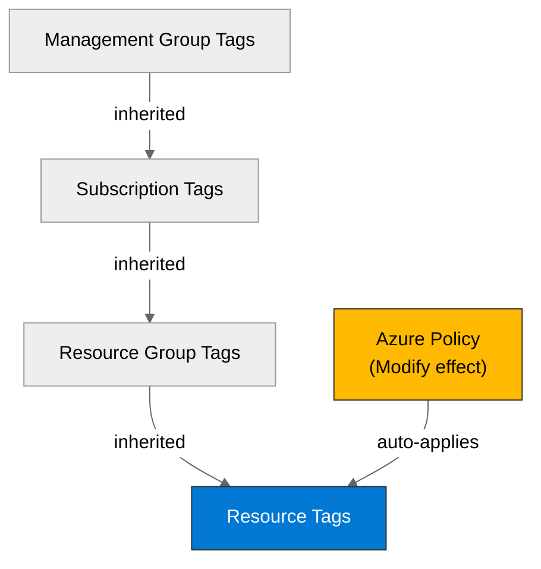

# Governance Constraints - {project-name}


<details>
<summary><strong>📑 Table of Contents</strong></summary>

- [Discovery Source](#discovery-source)
- [Azure Policy Compliance](#azure-policy-compliance)
- [Plan Adaptations Based on Policies](#plan-adaptations-based-on-policies)
- [Deployment Blockers](#deployment-blockers)
- [Required Tags](#required-tags)
- [Security Policies](#security-policies)
- [Cost Policies](#cost-policies)
- [Network Policies](#network-policies)
- [References](#references)

</details>

> Generated by bicep-plan agent | {date}

| ⬅️ Previous | 📑 Index | Next ➡️ |
| --- | --- | --- |
| [03-des-cost-estimate.md](03-des-cost-estimate.md) | [README](README.md) | [04-implementation-plan.md](04-implementation-plan.md) |

This document captures the governance constraints and Azure Policy requirements
that must be addressed in the Bicep implementation.

## Discovery Source

> [!IMPORTANT]
> Governance constraints MUST be discovered from Azure Resource Graph, not assumed.

| Query              | Results                 | Timestamp  |
| ------------------ | ----------------------- | ---------- |
| Policy Assignments | {X} policies discovered | {ISO-8601} |
| Tag Policies       | {X} tags required       | {ISO-8601} |
| Security Policies  | {X} constraints         | {ISO-8601} |

**Discovery Method**: Azure Resource Graph via MCP
**Subscription**: {subscription-name}
**Scope**: {management-group / subscription / resource-group}

> [!WARNING]
> If this section shows "UNVERIFIED" or is empty, governance constraints were
> assumed rather than discovered. Deployment may fail due to undiscovered policies.

### Policy Definition Analysis

> [!IMPORTANT]
> **MANDATORY**: For all Deny and DeployIfNotExists policies, document analysis of policy definition JSON (policyRule).

**Purpose**: Prevent false positives from misleading policy display names.
Verify actual blocking behavior before documenting constraints.

**Required for each Deny/DeployIfNotExists policy**:

| Policy Display Name | Assignment Scope | Effect | Actually Blocks | Evidence from policyRule.if |
|---------------------|------------------|--------|----------------|----------------------------|
| {Policy Name} | {Subscription/RG} | Deny | {What it really blocks} | `field: "type", equals: "Microsoft.{Type}"` |

**Example**:

| Policy Display Name | Assignment Scope | Effect | Actually Blocks | Evidence from policyRule.if |
|---------------------|------------------|--------|----------------|----------------------------|
| Block Azure RM Resource Creation | Management Group | Deny | Classic resources only (ClassicCompute, ClassicStorage, ClassicNetwork) | `anyOf` with 7 conditions checking `field: "type"` for Microsoft.Classic* types |
| Enforce storage encryption | Subscription | DeployIfNotExists | Nothing (auto-remediates) | Adds encryption config automatically |

**Analysis Notes**:
- Document any policies initially flagged as blockers but cleared after JSON analysis
- List conditional logic (tag requirements, resource type filters, configuration checks)
- Note deployment modifications from Modify/DeployIfNotExists policies

## Azure Policy Compliance

| Category       | Constraint         | Implementation   | Status |
| -------------- | ------------------ | ---------------- | ------ |
| Naming         | {naming-standard}  | {implementation} | ✅ / ⚠️ / ❌ |
| Tagging        | {tagging-policy}   | {implementation} | ✅ / ⚠️ / ❌ |
| Security       | {security-policy}  | {implementation} | ✅ / ⚠️ / ❌ |
| Data Residency | {residency-policy} | {implementation} | ✅ / ⚠️ / ❌ |

> [!WARNING]
> Any ❌ items are deployment blockers — resolve before proceeding to code generation.

## Plan Adaptations Based on Policies

> [!NOTE]
> This section documents how the implementation plan was adapted to comply with discovered Azure Policies.

### Architectural Changes

*Document any changes made to the original architecture to comply with Deny policies.*

| Original Design | Blocking Policy | Effect | Adaptation Applied |
|-----------------|----------------|--------|-------------------|
| Example: Public storage | Deny public access | Deny | Changed to private endpoints + vNet integration |

*If no adaptations were needed, note: "✅ Original architecture complies with all discovered policies."*

### Auto-Applied Resources

*Document resources that will be auto-deployed by DeployIfNotExists policies.*

| Policy | Effect | Auto-Applied Resource |
|--------|--------|----------------------|
| Example: Deploy diag settings | DeployIfNotExists | Log Analytics diagnostic settings |

*If none, note: "✅ No additional resources will be auto-deployed."*

### Auto-Modified Configurations

*Document configuration changes that will be automatically applied by Modify policies.*

| Policy | Effect | Auto-Applied Change |
|--------|--------|-------------------|
| Example: Inherit tags from RG | Modify | Tags auto-inherited from resource group |

*If none, note: "✅ No auto-modifications expected."*

## Deployment Blockers

> [!CAUTION]
> **CRITICAL**: This section lists policies that BLOCK deployment. Resolution required before proceeding to code generation.

*If no blockers, show: "✅ No deployment blockers detected."*

*Otherwise, document each blocker:*

### {Policy Display Name}

- **Policy ID**: `{policy-id}`
- **Effect**: Deny
- **Scope**: {management-group / subscription / resource-group}
- **Enforcement Mode**: {Default / DoNotEnforce}
- **Impact**: {description of what is blocked}
- **Assessment Date**: {YYYY-MM-DD}

**Resolution Options**:

1. **Request Policy Exemption**:
   - **Justification**: {reason}
   - **Duration**: {temporary / permanent}
   - **Risk Level**: {low / medium / high}
   - **Approval Process**: {steps}
   
2. **Alternative Architecture**:
   - {Description of compliant alternative}
   - **Trade-offs**: {performance / cost / complexity impacts}

**Status**: ⚠️ **DEPLOYMENT CANNOT PROCEED WITHOUT RESOLUTION**

**Next Steps**:
- [ ] User confirms exemption approval
- [ ] OR User approves alternative architecture
- [ ] OR User provides timeline for exemption

## Required Tags

All resources must include the following tags:

```bicep
tags: {
  Environment: environment  // dev, staging, prod
  Project: projectName      // {project-name}
  ManagedBy: 'Bicep'
  Owner: owner
}
```



> Replace tag keys with actual discovered policy requirements.

## Security Policies

| Policy           | Requirement   |
| ---------------- | ------------- |
| HTTPS Only       | {requirement} |
| TLS Version      | {requirement} |
| Public Access    | {requirement} |
| Managed Identity | {requirement} |
| Key Vault        | {requirement} |

## Cost Policies

| Policy            | Constraint   |
| ----------------- | ------------ |
| Budget            | {constraint} |
| SKU Restrictions  | {constraint} |
| Reserved Capacity | {constraint} |

## Network Policies

| Policy            | Constraint   |
| ----------------- | ------------ |
| Private Endpoints | {constraint} |
| VNet Integration  | {constraint} |
| Public Endpoints  | {constraint} |

---

## References

| Topic                | Link                                                                                                                       |
| -------------------- | -------------------------------------------------------------------------------------------------------------------------- |
| Azure Policy         | [Overview](https://learn.microsoft.com/azure/governance/policy/overview)                                                   |
| Azure Resource Graph | [ARG Overview](https://learn.microsoft.com/azure/governance/resource-graph/overview)                                       |
| Tag Governance       | [Tagging Strategy](https://learn.microsoft.com/azure/cloud-adoption-framework/ready/azure-best-practices/resource-tagging) |

---

*Governance constraints discovered from Azure Resource Graph.*
*See [governance-discovery.instructions.md](/.github/instructions/governance-discovery.instructions.md) for discovery methodology.*

---

| ⬅️ [03-des-cost-estimate.md](03-des-cost-estimate.md) | 🏠 [Project Index](README.md) | ➡️ [04-implementation-plan.md](04-implementation-plan.md) |
| --- | --- | --- |
