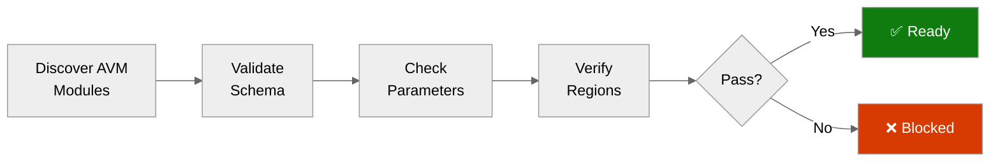

# Step 4b: Pre-Flight AVM Check - {project-name}

<strong>📑 Table of Contents</strong>

- [Purpose](#purpose)
- [AVM Schema Validation Results](#avm-schema-validation-results)
- [Parameter Type Analysis](#parameter-type-analysis)
- [Region Limitations Identified](#region-limitations-identified)
- [Pitfalls Checklist](#pitfalls-checklist)
- [Ready for Implementation](#ready-for-implementation)

> Generated by bicep-code agent | {YYYY-MM-DD}
> Status: **{PASS|FAIL|PENDING}**

| ⬅️ Previous | 📑 Index | Next ➡️ |
| --- | --- | --- |
| [04-implementation-plan.md](04-implementation-plan.md) | [README](README.md) | [05-implementation-reference.md](05-implementation-reference.md) |

## Purpose

> [!IMPORTANT]
> This checkpoint validates AVM module schemas BEFORE Bicep code generation.

Prevents:

- Parameter type mismatches (string vs int)
- Deprecated parameter usage
- Region availability issues
- Object structure errors

## AVM Schema Validation Results

| Resource     | AVM Module Path            | Version | Status |
| ------------ | -------------------------- | ------- | ------ |
| {Resource 1} | `br/public:avm/res/{path}` | x.x.x   | ✅/⚠️  |
| {Resource 2} | `br/public:avm/res/{path}` | x.x.x   | ✅/⚠️  |

## Parameter Type Analysis

<strong>Log Analytics Parameters</strong>

| Parameter          | Expected Type | Notes                    |
| ------------------ | ------------- | ------------------------ |
| `dailyQuotaGb`     | `string`      | NOT int                  |

<strong>Container App Parameters</strong>

| Parameter          | Expected Type | Notes                    |
| ------------------ | ------------- | ------------------------ |
| Logs config        | `object`      | Use appLogsConfiguration |

<strong>SQL Database Parameters</strong>

| Parameter          | Expected Type | Notes                    |
| ------------------ | ------------- | ------------------------ |
| `sku`              | `object`      | Not flat skuName/skuTier |
| `availabilityZone` | `int`         | Use -1 for no zone       |

> Replace with actual parameter groups discovered during AVM validation.

## Region Limitations Identified

| Resource         | Default Region | Limitation                     | Action              |
| ---------------- | -------------- | ------------------------------ | ------------------- |
| Static Web App   | swedencentral  | Not supported in swedencentral | Hardcode westeurope |
| {Other resource} | {region}       | {limitation if any}            | {action}            |

## Pitfalls Checklist

Based on [Azure Defaults Skill](../../.github/skills/azure-defaults/SKILL.md):

- [ ] Log Analytics `dailyQuotaGb` uses string type
- [ ] Container App Environment uses `appLogsConfiguration` object
- [ ] Container App uses `scaleSettings` object (not flat params)
- [ ] SQL Server uses `sku` object + `availabilityZone: -1`
- [ ] App Service uses connection string (not deprecated instrumentation key)
- [ ] Static Web App location hardcoded to supported region

## Ready for Implementation

| Check                      | Status | Notes |
| -------------------------- | ------ | ----- |
| All AVM modules verified   | ✅/❌  |       |
| Parameter types confirmed  | ✅/❌  |       |
| Region limitations handled | ✅/❌  |       |
| Pitfalls addressed         | ✅/❌  |       |

> [!IMPORTANT]
> **Go / No-Go Verdict**
>
> | Signal | Status |
> | ------ | ------ |
> | AVM Modules | ✅ / ❌ |
> | Parameters | ✅ / ❌ |
> | Regions | ✅ / ❌ |
> | Pitfalls | ✅ / ❌ |
> | **Overall** | **✅ READY / ❌ BLOCKED** |
>
> {If BLOCKED, list specific blockers and required actions}

---

_Pre-flight validation for {project-name} Bicep implementation_

---

| ⬅️ [04-implementation-plan.md](04-implementation-plan.md) | 🏠 [Project Index](README.md) | ➡️ [05-implementation-reference.md](05-implementation-reference.md) |
| --- | --- | --- |
