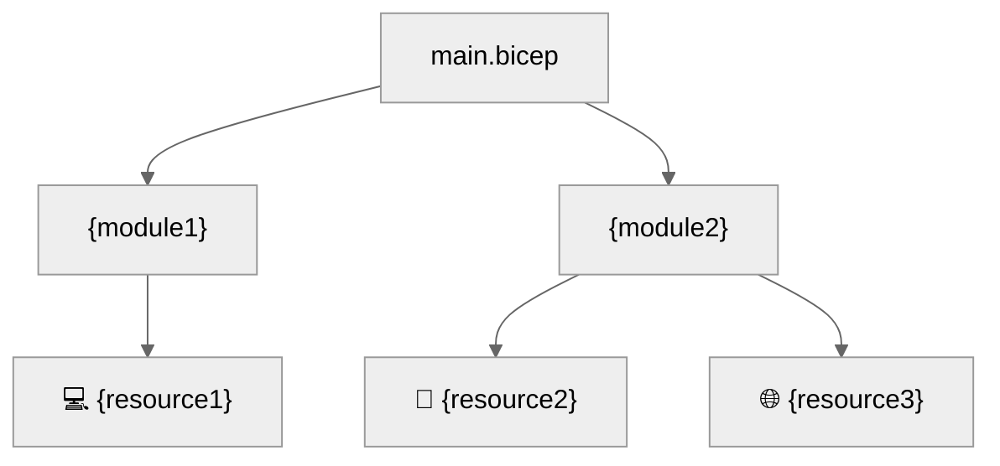

# Step 5: Implementation Reference - {project-name}


<details>
<summary><strong>📑 Table of Contents</strong></summary>

- [Bicep Templates Location](#bicep-templates-location)
- [File Structure](#file-structure)
- [Validation Status](#validation-status)
- [Resources Created](#resources-created)
- [Deployment Instructions](#deployment-instructions)
- [Key Implementation Notes](#key-implementation-notes)

</details>

> Generated by bicep-code agent | {date}

| ⬅️ Previous | 📑 Index | Next ➡️ |
| --- | --- | --- |
| [04-preflight-check.md](04-preflight-check.md) | [README](README.md) | [06-deployment-summary.md](06-deployment-summary.md) |

## Bicep Templates Location

📁 **Code Location**: [`infra/bicep/{project-name}/`](../../infra/bicep/{project-name}/)

## File Structure

```
infra/bicep/{project-name}/
├── main.bicep              # Main orchestration template
├── main.bicepparam         # Parameter file
├── deploy.ps1              # PowerShell deployment script
└── modules/
    └── {module}.bicep      # Resource modules
```

## Validation Status

| Check         | Result | Details |
| ------------- | ------ | ------- |
| `bicep build` | ✅ / ❌ | {details or error message} |
| `bicep lint`  | ✅ / ⚠️ / ❌ | {details or warning count} |
| `what-if`     | ✅ / ❌ | {resource count or error} |

## Resources Created

| Resource   | Bicep Type   | Module   |
| ---------- | ------------ | -------- |
| {resource} | {bicep-type} | {module} |



> Replace with actual module and resource names from generated Bicep.

## Deployment Instructions

<details>
<summary><strong>🟢 Quick Deploy (PowerShell)</strong></summary>

```powershell
cd infra/bicep/{project-name}
./deploy.ps1
```

</details>

<details>
<summary><strong>🔍 Preview Changes (What-If)</strong></summary>

```powershell
./deploy.ps1 -WhatIf
```

</details>

<details>
<summary><strong>⚙️ Custom Parameters</strong></summary>

```powershell
./deploy.ps1 `
    -ResourceGroupName "rg-{project}-{env}" `
    -Location "{location}" `
    -Environment "{env}"
```

</details>

<details>
<summary><strong>🚀 Azure CLI</strong></summary>

```bash
az deployment group create \
  --resource-group "rg-{project}-{env}" \
  --template-file main.bicep \
  --parameters main.bicepparam
```

</details>

## Key Implementation Notes

| Note | Impact | Reference |
| ---- | ------ | --------- |
| Unique suffix via `uniqueString(resourceGroup().id)` | All resource names | main.bicep |
| {additional note} | {impact area} | {module/file} |

```bicep
var uniqueSuffix = uniqueString(resourceGroup().id)
// Example: {resource-prefix}-{suffix}
```

{additional-implementation-notes}

---

_Implementation reference generated from Bicep templates._

---

| ⬅️ [04-preflight-check.md](04-preflight-check.md) | 🏠 [Project Index](README.md) | ➡️ [06-deployment-summary.md](06-deployment-summary.md) |
| --- | --- | --- |
