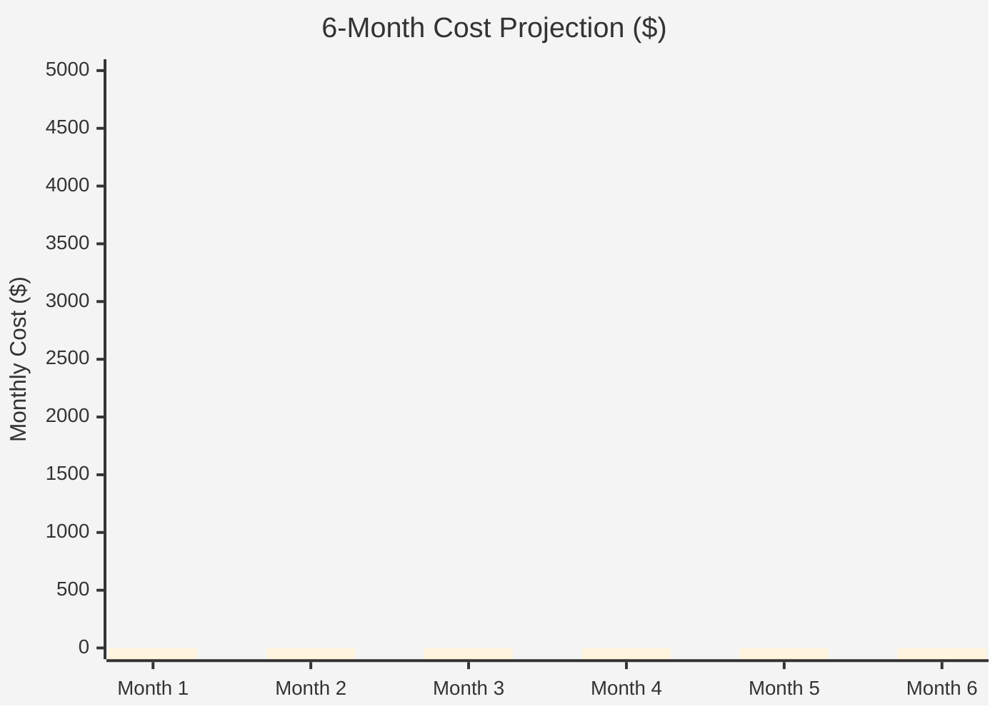

# As-Built Cost Estimate: {project-name}


<details>
<summary><strong>📑 Table of Contents</strong></summary>

- [💰 Cost At-a-Glance](#-cost-at-a-glance)
- [✅ Decision Summary](#-decision-summary)
- [🔁 Requirements → Cost Mapping](#-requirements--cost-mapping)
- [📊 Top 5 Cost Drivers](#-top-5-cost-drivers)
- [Architecture Overview](#architecture-overview)
- [🧾 What We Are Not Paying For (Yet)](#-what-we-are-not-paying-for-yet)
- [⚠️ Cost Risk Indicators](#-cost-risk-indicators)
- [🎯 Quick Decision Matrix](#-quick-decision-matrix)
- [💰 Savings Opportunities](#-savings-opportunities)
- [Detailed Cost Breakdown](#detailed-cost-breakdown)
- [References](#references)

</details>

> Generated by {agent} agent | {date}

| ⬅️ Previous                                        | 📑 Index            | Next ➡️ |
| -------------------------------------------------- | ------------------- | ------- |
| [07-compliance-matrix.md](07-compliance-matrix.md) | [README](README.md) | —       |

**Generated**: {YYYY-MM-DD}
**Source**: Implemented Bicep Templates
**Region**: {primary-region}
**Environment**: {Production|Staging|Development}
**MCP Tools Used**: {azure_price_search, azure_cost_estimate}
**IaC Reference**: {relative link to infra/bicep/{project}/, if available}

## 💰 Cost At-a-Glance

> **Monthly Total: ~$X,XXX** | Annual: ~$XX,XXX
>
> ```
> Budget: {No fixed budget|$X/month (soft|hard)} | Utilization: {NN% ($X of $X)|N/A}
> ```
>
> | Status            | Indicator                    |
> | ----------------- | ---------------------------- |
> | Cost Trend        | ➡️ Stable                    |
> | Savings Available | 💰 $X/year with reservations |
> | Compliance        | ✅ {e.g., PCI-DSS aligned}   |

## ✅ Decision Summary

- ✅ Implemented: {what is in-scope and deployed}
- ⏳ Deferred: {what is explicitly not included yet}
- 🔁 Redesign Trigger: {what requirement change forces SKU/region redesign}

**Confidence**: {High|Medium|Low} | **Expected Variance**: ±{X}% ({1 sentence why})

### Design vs As-Built Summary

| Metric           | Design Estimate | As-Built | Variance    | Status       |
| ---------------- | --------------- | -------- | ----------- | ------------ |
| Monthly Estimate | ${X}            | ${X}     | {+$X / -$X} | ✅ / ⚠️ / ❌ |
| Annual Estimate  | ${X}            | ${X}     | {+$X / -$X} | ✅ / ⚠️ / ❌ |



```mermaid
%%{init: {"theme": "base", "themeVariables": {"primaryColor": "#0078D4"}}}%%
xychart-beta
    title "Design vs As-Built Cost ($)"
    x-axis ["Compute", "Data", "Network", "Security", "Monitor", "Total"]
    y-axis "Monthly Cost ($)" 0 --> 5000
    bar [0, 0, 0, 0, 0, 0]
    bar [0, 0, 0, 0, 0, 0]
```

> First bar = Design estimate, second bar = As-Built actual. Replace values.

## 🔁 Requirements → Cost Mapping

| Requirement           | Architecture Decision | Cost Impact    | Mandatory  |
| --------------------- | --------------------- | -------------- | ---------- |
| {SLA/RTO/RPO}         | {decision}            | {+$X/month}    | {Yes / No} |
| {Compliance}          | {decision}            | {+$X/month 📈} | {Yes / No} |
| {Latency/Performance} | {decision}            | {+$X/month}    | {Yes / No} |

## 📊 Top 5 Cost Drivers

| Rank | Resource        | Monthly Cost | % of Total | Trend | Optimization |
| ---- | --------------- | ------------ | ---------- | ----- | ------------ |
| 1️⃣   | {service / SKU} | ${X}         | {Y%}       | ➡️    | {action}     |
| 2️⃣   | {service / SKU} | ${X}         | {Y%}       | ➡️    | {action}     |
| 3️⃣   | {service / SKU} | ${X}         | {Y%}       | ➡️    | {action}     |
| 4️⃣   | {service / SKU} | ${X}         | {Y%}       | ➡️    | {action}     |
| 5️⃣   | {service / SKU} | ${X}         | {Y%}       | ➡️    | {action}     |

> 💡 **Quick Win**: {one low-effort action that saves meaningful cost}

<details>
<summary><strong>Cost Driver Details</strong></summary>

#### 1️⃣ {Top Driver Name}

| Aspect            | Detail                                  |
| ----------------- | --------------------------------------- |
| Current SKU       | {sku}                                   |
| Monthly Cost      | ${X}                                    |
| Cost Breakdown    | {compute: $X, storage: $Y, network: $Z} |
| Optimization      | {specific action to reduce cost}        |
| Potential Savings | ${X}/month with {RI/SP/right-sizing}    |

</details>

## Architecture Overview

### Cost Distribution

| Category         | Monthly Cost (USD) | Share |
| ---------------- | -----------------: | ----: |
| 💻 Compute       |                535 |   39% |
| 💾 Data Services |                466 |   34% |
| 🌐 Networking    |                376 |   27% |


### Month-over-Month Projection



> Replace bar values with actual projected costs.

### Key Design Decisions Affecting Cost

| Decision  | Cost Impact    | Business Rationale | Status                |
| --------- | -------------- | ------------------ | --------------------- |
| {example} | +$.../month 📈 | {why}              | {Required / Optional} |

## 🧾 What We Are Not Paying For (Yet)

- {Example: multi-region active-active}
- {Example: private endpoints for all services}
- {Example: premium HA cache}
- {Example: DDoS Standard}

## ⚠️ Cost Risk Indicators

| Resource        | Risk Level                     | Issue  | Mitigation   |
| --------------- | ------------------------------ | ------ | ------------ |
| {service / SKU} | {🔴 High / 🟡 Medium / 🟢 Low} | {risk} | {mitigation} |

> **⚠️ Watch Item**: {one sentence on biggest budget uncertainty}

## 🎯 Quick Decision Matrix

_"If you need X, expect to pay Y more"_

| Requirement                  | Additional Cost | SKU Change | Verdict                             | Notes   |
| ---------------------------- | --------------- | ---------- | ----------------------------------- | ------- |
| {Example: 99.99% SLA}        | +$.../month     | {SKU move} | 🟢 Go / 🟡 Monitor / 🔴 Investigate | {notes} |
| {Example: Private Endpoints} | +$.../month     | {config}   | 🟢 Go / 🟡 Monitor / 🔴 Investigate | {notes} |

## 💰 Savings Opportunities

> ### Total Potential Savings: ${X}/year
>
> | Strategy                | Commitment | Monthly Savings | Annual Savings | % Reduction |
> | ----------------------- | ---------- | --------------- | -------------- | ----------- |
> | Reserved Instances (RI) | 1-year     | ${...}          | ${...}         | {X%}        |
> | Reserved Instances (RI) | 3-year     | ${...}          | ${...}         | {X%}        |
> | Savings Plan (SP)       | 1-year     | ${...}          | ${...}         | {X%}        |
> | Right-sizing            | N/A        | ${...}          | ${...}         | {X%}        |
> | Dev/Test Pricing        | N/A        | ${...}          | ${...}         | {X%}        |

## Detailed Cost Breakdown

### IaC / Pricing Coverage

| Signal             | Value       | Status  |
| ------------------ | ----------- | ------- |
| Templates scanned  | {n}         | ✅      |
| Resources detected | {n}         | ✅      |
| Resources priced   | {n}         | ✅ / ⚠️ |
| Unpriced resources | {list or 0} | ✅ / ❌ |

### Line Items

| Category         | Service   | SKU / Meter | Quantity / Units | Est. Monthly |
| ---------------- | --------- | ----------- | ---------------- | ------------ |
| 💻 Compute       | {service} | {SKU}       | {qty}            | ${...}       |
| 💾 Data Services | {service} | {SKU}       | {qty}            | ${...}       |
| 🌐 Networking    | {service} | {meter}     | {qty}            | ${...}       |

### Notes

- {Call out price assumptions, gaps, and any known variances vs design}

---

## References

| Topic                    | Link                                                                                                                   |
| ------------------------ | ---------------------------------------------------------------------------------------------------------------------- |
| Azure Pricing Calculator | [Calculator](https://azure.microsoft.com/pricing/calculator/)                                                          |
| Cost Management          | [Overview](https://learn.microsoft.com/azure/cost-management-billing/costs/overview-cost-management)                   |
| Reserved Instances       | [Reservations](https://learn.microsoft.com/azure/cost-management-billing/reservations/save-compute-costs-reservations) |
| WAF Cost Optimization    | [Checklist](https://learn.microsoft.com/azure/well-architected/cost-optimization/checklist)                            |

---

| ⬅️ [07-compliance-matrix.md](07-compliance-matrix.md) | 🏠 [Project Index](README.md) | ➡️ — |
| ----------------------------------------------------- | ----------------------------- | ---- |
