# Backup and Disaster Recovery Plan: {project-name}


<details>
<summary><strong>📑 Table of Contents</strong></summary>

- [Executive Summary](#executive-summary)
- [1. Recovery Objectives](#1-recovery-objectives)
- [2. Backup Strategy](#2-backup-strategy)
- [3. Disaster Recovery Procedures](#3-disaster-recovery-procedures)
- [4. Testing Schedule](#4-testing-schedule)
- [5. Communication Plan](#5-communication-plan)
- [6. Roles and Responsibilities](#6-roles-and-responsibilities)
- [7. Dependencies](#7-dependencies)
- [8. Recovery Runbooks](#8-recovery-runbooks)
- [9. Appendix](#9-appendix)
- [References](#references)

</details>

> Generated by {agent} agent | {date}

| ⬅️ Previous | 📑 Index | Next ➡️ |
| --- | --- | --- |
| [07-resource-inventory.md](07-resource-inventory.md) | [README](README.md) | [07-compliance-matrix.md](07-compliance-matrix.md) |

**Generated**: {date}
**Version**: 1.0
**Environment**: {environment}
**Primary Region**: {primary-region}
**Secondary Region**: {secondary-region}

---

## Executive Summary

> [!IMPORTANT]
> This document defines the backup strategy and disaster recovery procedures for {project-name}.

| Metric           | Current   | Target   |
| ---------------- | --------- | -------- |
| **RPO**          | {current} | {target} |
| **RTO**          | {current} | {target} |
| **Availability** | {current} | {target} |

---

## 1. Recovery Objectives

### 1.1 Recovery Time Objective (RTO)

| Tier      | RTO Target | Services   |
| --------- | ---------- | ---------- |
| 🔴 Critical  | {time}     | {services} |
| 🟠 Important | {time}     | {services} |
| 🟢 Standard  | {time}     | {services} |

### 1.2 Recovery Point Objective (RPO)

| Data Type   | RPO Target | Backup Strategy   |
| ----------- | ---------- | ----------------- |
| {data-type} | {target}   | {backup-strategy} |

```mermaid
%%{init: {'theme':'neutral'}}%%
gantt
    title RPO / RTO Targets by Tier
    dateFormat HH:mm
    axisFormat %H:%M
    section Critical
        RPO :crit, rpo1, 00:00, 15min
        RTO :crit, rto1, 00:00, 1h
    section Important
        RPO :rpo2, 00:00, 1h
        RTO :rto2, 00:00, 4h
    section Standard
        RPO :rpo3, 00:00, 4h
        RTO :rto3, 00:00, 24h
```



> Replace durations with actual RPO/RTO targets.

---

## 2. Backup Strategy

<details>
<summary><strong>💾 Azure SQL Database</strong></summary>

| Setting             | Configuration |
| ------------------- | ------------- |
| Backup Type         | {config}      |
| Retention (PITR)    | {config}      |
| Long-Term Retention | {config}      |
| Geo-Redundancy      | {config}      |

**Point-in-Time Restore Command:**

```bash
az sql db restore \
  --resource-group {rg} \
  --server {server} \
  --name {db} \
  --dest-name {db}-restored \
  --time "{timestamp}"
```

</details>

<details>
<summary><strong>🔐 Azure Key Vault</strong></summary>

| Setting          | Configuration |
| ---------------- | ------------- |
| Soft Delete      | {config}      |
| Purge Protection | {config}      |

</details>

---

## 3. Disaster Recovery Procedures

<details>
<summary><strong>🌍 Region Failover</strong></summary>

### 3.1 Failover Procedure

{failover-procedure}

</details>

<details>
<summary><strong>↩️ Failback Procedure</strong></summary>

### 3.2 Failback Procedure

{failback-procedure}

</details>

---

## 4. Testing Schedule

| Test Type   | Frequency   | Last Test   | Next Test   |
| ----------- | ----------- | ----------- | ----------- |
| {test-type} | {frequency} | {last-test} | {next-test} |


> Replace with actual testing schedule.

---

## 5. Communication Plan

| Audience   | Channel   | Template   |
| ---------- | --------- | ---------- |
| {audience} | {channel} | {template} |

---

## 6. Roles and Responsibilities

| Role   | Team   | Responsibility   |
| ------ | ------ | ---------------- |
| {role} | {team} | {responsibility} |

---

## 7. Dependencies

| Dependency   | Impact   | Mitigation   |
| ------------ | -------- | ------------ |
| {dependency} | {impact} | {mitigation} |

---

## 8. Recovery Runbooks

| Scenario   | Runbook   | Owner   |
| ---------- | --------- | ------- |
| {scenario} | {runbook} | {owner} |

<details>
<summary><strong>📖 Runbook: {Scenario Name}</strong></summary>

**Trigger**: {trigger condition}
**Estimated Duration**: {time}

1. {step-1}
2. {step-2}
3. {step-3}

**Validation**:

```bash
# Verify recovery
{validation-command}
```

</details>

---

## 9. Appendix

<details>
<summary>📋 Detailed Recovery Procedures</summary>

{appendix-content}

</details>

---

## References

> [!NOTE]
> 📚 The following Microsoft Learn resources provide DR guidance.

| Topic                 | Link                                                                                            |
| --------------------- | ----------------------------------------------------------------------------------------------- |
| Azure Backup Overview | [Backup Overview](https://learn.microsoft.com/azure/backup/backup-overview)                     |
| Backup Best Practices | [Best Practices](https://learn.microsoft.com/azure/backup/backup-best-practices)                |
| RTO/RPO Guidance      | [Reliability Metrics](https://learn.microsoft.com/azure/well-architected/reliability/metrics)   |
| Site Recovery         | [ASR Overview](https://learn.microsoft.com/azure/site-recovery/site-recovery-overview)          |
| Business Continuity   | [DR Planning](https://learn.microsoft.com/azure/well-architected/reliability/disaster-recovery) |

---

_Backup and DR plan generated from infrastructure artifacts._

---

| ⬅️ [07-resource-inventory.md](07-resource-inventory.md) | 🏠 [Project Index](README.md) | ➡️ [07-compliance-matrix.md](07-compliance-matrix.md) |
| --- | --- | --- |
