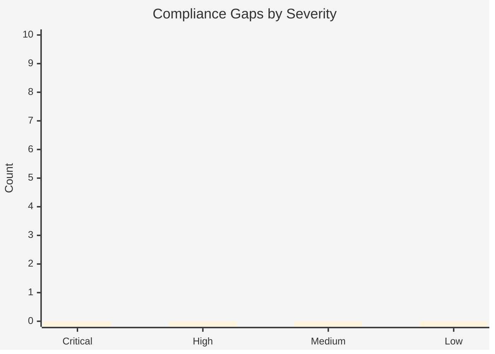

# Compliance Matrix: {project-name}

<strong>📑 Table of Contents</strong>

- [Executive Summary](#executive-summary)
- [1. Control Mapping](#1-control-mapping)
- [2. Gap Analysis](#2-gap-analysis)
- [3. Evidence Collection](#3-evidence-collection)
- [4. Audit Trail](#4-audit-trail)
- [5. Remediation Tracker](#5-remediation-tracker)
- [6. Appendix](#6-appendix)
- [References](#references)

> Generated by {agent} agent | {date}

| ⬅️ Previous | 📑 Index | Next ➡️ |
| --- | --- | --- |
| [07-backup-dr-plan.md](07-backup-dr-plan.md) | [README](README.md) | [07-ab-cost-estimate.md](07-ab-cost-estimate.md) |

**Generated**: {date}
**Version**: 1.0
**Environment**: {environment}
**Primary Compliance Framework**: {compliance-framework}

---

## Executive Summary

> [!IMPORTANT]
> This compliance matrix maps the {project-name} security controls to {compliance-framework} requirements.

| Compliance Area    | Coverage | Status   |
| ------------------ | -------- | -------- |
| Network Security   |       | ✅ / ⚠️ / ❌ |
| Access Control     |       | ✅ / ⚠️ / ❌ |
| Incident Response  |       | ✅ / ⚠️ / ❌ |

---

## 1. Control Mapping

### Requirement 1: {requirement-category}

| Control   | Requirement   | Implementation   | Status   |
| --------- | ------------- | ---------------- | -------- |
| {control} | {requirement} | {implementation} | ✅ / ⚠️ / ❌ |

<strong>📎 Evidence</strong>

**Evidence Location**: {evidence-path}

| Evidence Item | Type | Date Collected |
| ------------- | ---- | -------------- |
| {item}        | {type} | {date}       |

---

## 2. Gap Analysis

| Gap   | Severity | Risk Level | Remediation   | Timeline   |
| ----- | -------- | ---------- | ------------- | ---------- |
| {gap} | 🔴 / 🟡 / 🟢 | {risk} | {remediation} | {timeline} |

> Replace bar values with actual gap counts.

---

## 3. Evidence Collection

<strong>📁 Evidence Items</strong>

| Control   | Evidence Type   | Location   | Last Collected |
| --------- | --------------- | ---------- | -------------- |
| {control} | {evidence-type} | {location} | {date}         |

---

## 4. Audit Trail

| Date   | Auditor   | Finding   | Status   | Commit |
| ------ | --------- | --------- | -------- | ------ |
| {date} | {auditor} | {finding} | {status} | [{sha}]({repo-url}/commit/{sha}) |

---

## 5. Remediation Tracker

| Finding   | Owner   | Due Date   | Status   |
| --------- | ------- | ---------- | -------- |
| {finding} | {owner} | {due-date} | ⬜ Todo / 🔄 In Progress / ✅ Done |

---

## 6. Appendix

### A. Compliance Framework Reference

{framework-reference}

### B. Azure Security Baseline Mapping

{security-baseline}

---

## References

> [!NOTE]
> 📚 The following Microsoft Learn resources provide compliance guidance.

| Topic                              | Link                                                                                                                        |
| ---------------------------------- | --------------------------------------------------------------------------------------------------------------------------- |
| Microsoft Cloud Security Benchmark | [MCSB Overview](https://learn.microsoft.com/security/benchmark/azure/overview)                                              |
| Azure Compliance Offerings         | [Compliance](https://learn.microsoft.com/azure/compliance/)                                                                 |
| Azure Policy                       | [Policy Overview](https://learn.microsoft.com/azure/governance/policy/overview)                                             |
| Regulatory Compliance              | [Built-in Policies](https://learn.microsoft.com/azure/governance/policy/samples/built-in-initiatives#regulatory-compliance) |

---

_Compliance matrix generated from infrastructure artifacts._

---

| ⬅️ [07-backup-dr-plan.md](07-backup-dr-plan.md) | 🏠 [Project Index](README.md) | ➡️ [07-ab-cost-estimate.md](07-ab-cost-estimate.md) |
| --- | --- | --- |
