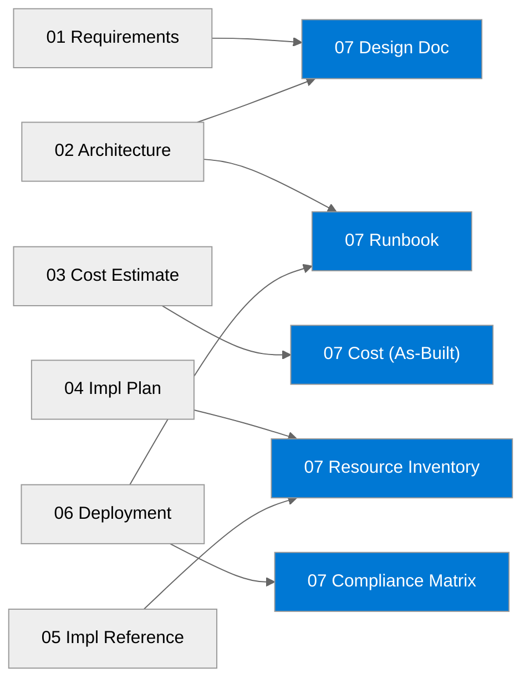

# {project-name} - Workload Documentation

<strong>📑 Table of Contents</strong>

- [1. Document Package Contents](#1-document-package-contents)
- [2. Source Artifacts](#2-source-artifacts)
- [3. Project Summary](#3-project-summary)
- [4. Related Resources](#4-related-resources)
- [5. Quick Links](#5-quick-links)

> Generated by {agent} agent | {date}

| ⬅️ Previous | 📑 Index | Next ➡️ |
| --- | --- | --- |
| [06-deployment-summary.md](06-deployment-summary.md) | [README](README.md) | [07-design-document.md](07-design-document.md) |

**Generated**: {date}
**Version**: 1.0
**Status**: Draft

---

## 1. Document Package Contents

| Document                                         | Description                        | Status   |
| ------------------------------------------------ | ---------------------------------- | -------- |
| [Design Document](./07-design-document.md)       | Comprehensive architecture design  |  /  |
| [Operations Runbook](./07-operations-runbook.md) | Day-2 operational procedures       |  /  |
| [Resource Inventory](./07-resource-inventory.md) | Complete resource listing from IaC |  /  |
| [Compliance Matrix](./07-compliance-matrix.md)   | Security controls mapping          |  /  |
| [Backup & DR Plan](./07-backup-dr-plan.md)       | Recovery procedures and failover   |  /  |

---

## 2. Source Artifacts

These documents were generated from the following agentic workflow outputs:

| Artifact            | Source   | Generated |
| ------------------- | -------- | --------- |
| Requirements        | {source} | {date}    |
| WAF Assessment      | {source} | {date}    |
| Cost Estimate       | {source} | {date}    |
| Implementation Plan | {source} | {date}    |
| Bicep Code          | {source} | {date}    |

> Shows which workflow artifacts feed into each Step 7 document.

---

## 3. Project Summary

| Attribute          | Value        |
| ------------------ | ------------ |
| **Project Name**   | {project}    |
| **Environment**    | {env}        |
| **Primary Region** | {region}     |
| **Compliance**     | {compliance} |
| **Monthly Cost**   | {cost}       |

---

## 4. Related Resources

- **Infrastructure Code**: [`infra/bicep/{project}/`](../../infra/bicep/{project}/)
- **Agent Outputs**: [`agent-output/{project}/`](./)
- **ADRs**: See `*-adr-*.md` files in this folder (if generated)

---

## 5. Quick Links

- 📂 **Code**: [Deployment Script](../../infra/bicep/{project}/deploy.ps1) | [Main Bicep Template](../../infra/bicep/{project}/main.bicep)
- 📄 **Docs**: [Design Document](./07-design-document.md) | [Runbook](./07-operations-runbook.md) | [Compliance](./07-compliance-matrix.md)
- 🔗 **External**: [Azure Well-Architected Framework](https://learn.microsoft.com/azure/well-architected/) | [AVM Index](https://aka.ms/avm/index)

---

_Documentation index generated by Workload Documentation Generator._

---

| ⬅️ [06-deployment-summary.md](06-deployment-summary.md) | 🏠 [Project Index](README.md) | ➡️ [07-design-document.md](07-design-document.md) |
| --- | --- | --- |
