# Operations Runbook: {project-name}


<details>
<summary><strong>📑 Table of Contents</strong></summary>

- [Quick Reference](#quick-reference)
- [1. Daily Operations](#1-daily-operations)
- [2. Incident Response](#2-incident-response)
- [3. Common Procedures](#3-common-procedures)
- [4. Maintenance Windows](#4-maintenance-windows)
- [5. Contacts & Escalation](#5-contacts--escalation)
- [6. Change Log](#6-change-log)
- [References](#references)

</details>

> Generated by {agent} agent | {date}

| ⬅️ Previous | 📑 Index | Next ➡️ |
| --- | --- | --- |
| [07-design-document.md](07-design-document.md) | [README](README.md) | [07-resource-inventory.md](07-resource-inventory.md) |

**Version**: 1.0
**Date**: {date}
**Environment**: {environment}
**Region**: {region}

---

## Quick Reference

| Item                | Value             |
| ------------------- | ----------------- |
| **Primary Region**  | {region}          |
| **Resource Group**  | {resource-group}  |
| **Support Contact** | {support-contact} |
| **Escalation Path** | {escalation-path} |

### Critical Resources

| Resource   | Name   | Resource Group   | Severity |
| ---------- | ------ | ---------------- | -------- |
| {resource} | {name} | {resource-group} | 🔴 P1 / 🟠 P2 / 🟢 P3 |

---

## 1. Daily Operations

### 1.1 Health Checks

**Morning Health Check:**

1. ✅ {health-check-1}
2. ✅ {health-check-2}
3. ✅ {health-check-3}

**KQL Query - System Health Overview:**

<details>
<summary><strong>📊 Health Check KQL</strong></summary>

```kusto
// Health query example
{kql-query}
```

</details>

### 1.2 Log Review

**Priority Logs to Review:**

| Log Source   | Query Focus   | Action Threshold |
| ------------ | ------------- | ---------------- |
| {log-source} | {query-focus} | {threshold}      |

---

## 2. Incident Response

### 2.1 Severity Definitions

| Severity | Definition   | Response Time |
| -------- | ------------ | ------------- |
| 🔴 P1  | {definition} | {time}        |
| 🟠 P2  | {definition} | {time}        |
| 🟢 P3  | {definition} | {time}        |

### Incident Response Flow

```mermaid
%%{init: {'theme':'neutral'}}%%
flowchart LR
    D["🔍 Detect"] --> T["🎯 Triage"]
    T --> E["⚠️ Escalate"]
    E --> R["🛠️ Resolve"]
    R --> P["📝 Postmortem"]
    style D fill:#D83B01,color:#fff
    style R fill:#107C10,color:#fff
```



### 2.2 Runbooks by Alert

| Alert        | Runbook            | Owner   |
| ------------ | ------------------ | ------- |
| {alert-name} | {runbook-location} | {owner} |

---

## 3. Common Procedures

### 3.1 Restart Services

<details>
<summary>🔧 Restart App Service</summary>

```bash
# Restart App Service
{restart-command}
```

</details>

### 3.2 Scale Resources

<details>
<summary>📈 Scale Up/Out Commands</summary>

```bash
# Scale up/out
{scale-command}
```

</details>

---

## 4. Maintenance Windows

| Task               | Schedule   | Duration   |
| ------------------ | ---------- | ---------- |
| {maintenance-task} | {schedule} | {duration} |


> Replace with actual maintenance schedule.

> [!TIP]
> 💡 Schedule maintenance during low-traffic periods. Use Azure Update Manager for coordinated patching.

---

## 5. Contacts & Escalation

| Role   | Contact   | Phone   | On-Call Rotation |
| ------ | --------- | ------- | ---------------- |
| {role} | {contact} | {phone} | {schedule / N/A} |

### Escalation Path

```mermaid
%%{init: {'theme':'neutral'}}%%
flowchart TD
    L1["🟢 L1: On-Call Engineer"] --> L2["🟠 L2: Team Lead"]
    L2 --> L3["🔴 L3: Service Owner"]
    L3 --> MGMT["⚠️ Management"]
```



---

## 6. Change Log

| Date   | Change   | Author   |
| ------ | -------- | -------- |
| {date} | {change} | {author} |

---

## References

> [!NOTE]
> 📚 The following Microsoft Learn resources provide operational guidance.

| Topic                 | Link                                                                                             |
| --------------------- | ------------------------------------------------------------------------------------------------ |
| Azure Monitor Alerts  | [Alerting Best Practices](https://learn.microsoft.com/azure/azure-monitor/best-practices-alerts) |
| Log Analytics Queries | [KQL Reference](https://learn.microsoft.com/azure/azure-monitor/logs/get-started-queries)        |
| Incident Management   | [Azure Status](https://status.azure.com/)                                                        |
| Service Health        | [Azure Service Health](https://learn.microsoft.com/azure/service-health/overview)                |

---

_Operations runbook generated from infrastructure artifacts._

---

| ⬅️ [07-design-document.md](07-design-document.md) | 🏠 [Project Index](README.md) | ➡️ [07-resource-inventory.md](07-resource-inventory.md) |
| --- | --- | --- |
