# Resource Inventory: {project-name}

<strong>📑 Table of Contents</strong>

- [Summary](#summary)
- [Resource Listing](#resource-listing)
- [References](#references)

> Generated by {agent} agent | {date}

| ⬅️ Previous | 📑 Index | Next ➡️ |
| --- | --- | --- |
| [07-operations-runbook.md](07-operations-runbook.md) | [README](README.md) | [07-backup-dr-plan.md](07-backup-dr-plan.md) |

**Generated**: {date}
**Source**: Infrastructure as Code (Bicep)
**Environment**: {environment}
**Region**: {region}

---

## Summary

| Category            | Count |
| ------------------- | ----- |
| **Total Resources** | {n}   |
| 💻 Compute          | {n}   |
| 💾 Data Services    | {n}   |
| 🌐 Networking       | {n}   |
| 📨 Messaging        | {n}   |
| 🔐 Security         | {n}   |
| 📊 Monitoring       | {n}   |

---

## Resource Listing

### 💻 Compute Resources

| Name   | Type   | SKU   | Location   | Monthly Cost | Purpose   | Portal |
| ------ | ------ | ----- | ---------- | ------------ | --------- | ------ |
| {name} | {type} | {sku} | {location} | ${X}         | {purpose} | [View](https://portal.azure.com/#@/resource/{resource-id}) |

### 💾 Data Services

| Name   | Type   | SKU   | Configuration | Location   | Monthly Cost |
| ------ | ------ | ----- | ------------- | ---------- | ------------ |
| {name} | {type} | {sku} | {config}      | {location} | ${X}         |

### 🌐 Networking Resources

| Name   | Type   | Configuration | Location   |
| ------ | ------ | ------------- | ---------- |
| {name} | {type} | {config}      | {location} |

### 📨 Messaging Resources

| Name   | Type   | SKU   | Configuration | Location   |
| ------ | ------ | ----- | ------------- | ---------- |
| {name} | {type} | {sku} | {config}      | {location} |

### 🔐 Security Resources

| Name   | Type   | Configuration | Location   |
| ------ | ------ | ------------- | ---------- |
| {name} | {type} | {config}      | {location} |

### 📊 Monitoring Resources

| Name   | Type   | Retention   | Location   |
| ------ | ------ | ----------- | ---------- |
| {name} | {type} | {retention} | {location} |

---

```mermaid
%%{init: {'theme':'base','themeVariables':{pie1:'#0078D4',pie2:'#107C10',pie3:'#5C2D91',pie4:'#D83B01',pie5:'#FFB900',pie6:'#008575'}}}%%
pie showData
    title Resource Distribution by Category
    "💻 Compute" : 0
    "💾 Data" : 0
    "🌐 Networking" : 0
    "📨 Messaging" : 0
    "🔐 Security" : 0
    "📊 Monitoring" : 0
```

> Replace values with actual resource counts per category.

---

## References

| Topic                | Link                                                                                                                   |
| -------------------- | ---------------------------------------------------------------------------------------------------------------------- |
| Azure Resource Types | [Resource Providers](https://learn.microsoft.com/azure/azure-resource-manager/management/resource-providers-and-types) |
| Naming Conventions   | [CAF Naming](https://learn.microsoft.com/azure/cloud-adoption-framework/ready/azure-best-practices/resource-naming)    |
| Pricing Calculator   | [Azure Pricing](https://azure.microsoft.com/pricing/calculator/)                                                       |

---

_Resource inventory generated from Bicep templates._

---

| ⬅️ [07-operations-runbook.md](07-operations-runbook.md) | 🏠 [Project Index](README.md) | ➡️ [07-backup-dr-plan.md](07-backup-dr-plan.md) |
| --- | --- | --- |
