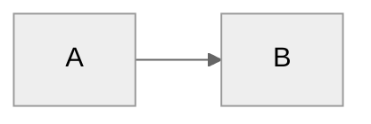

# Documentation Standards Reference

> For use by the `docs-writer` skill. Consolidates rules from
> `markdown.instructions.md` and `docs.instructions.md`.

## File Header Pattern

Every doc in `docs/` must start with:

```markdown
# {Title}

> [Current Version](../VERSION.md) | {One-line description}
```

- Version number: always read from `VERSION.md` (single source of truth)
- Description: one sentence summarizing the document's purpose

## Heading Rules

| Rule | Detail |
| --- | --- |
| Single H1 | Only the document title uses `#` |
| ATX style | Always `##`, `###` — never underline style |
| No H4+ | Avoid `####` and deeper; restructure content instead |
| Numbering | Template artifacts use numbered H2s (`## 1. Section`) |

## Line Length

**120 characters maximum** — enforced by CI and pre-commit hooks.

Breaking strategies:

1. **Sentences**: break after punctuation (period, comma, em-dash)
2. **Lists**: continue on next line with matching indentation
3. **Links**: break before `[` or use reference-style links
4. **Tables**: allowed to exceed when column content requires it

## Link Conventions

| Type | Format |
| --- | --- |
| Internal docs | `[Quickstart](quickstart.md)` — relative paths |
| Cross-folder | `[Workflow](../docs/workflow.md)` — relative from source |
| External URLs | Reference-style: `[Azure docs][azure-waf]` with `[azure-waf]: https://...` at bottom |
| Anchors | `[Section](#section-name)` — lowercase, hyphenated |

## Mermaid Diagrams

Every Mermaid block must include the neutral theme directive:

````markdown

````

## Callout Syntax

Use GitHub-flavored callouts:

```markdown
> [!NOTE]
> Informational highlight.

> [!TIP]
> Helpful advice for the reader.

> [!WARNING]
> Something that could cause issues.
```

## Code Blocks

Always specify language after opening backticks:

- Bicep: `` ```bicep ``
- PowerShell: `` ```powershell ``
- Bash: `` ```bash ``
- JSON: `` ```json ``
- YAML: `` ```yaml ``
- Markdown: `` ```markdown ``
- Plain text: `` ```text ``

## Tables

| Standard | Rule |
| --- | --- |
| Header row | Always include |
| Alignment | Left-align by default (use `\| --- \|`) |
| Pipe spacing | Space after opening pipe, space before closing pipe |
| Column width | Keep readable; align pipes vertically |

## Prohibited References

These agents were removed and converted to skills. Never reference them:

| Removed Agent | Replacement Skill |
| --- | --- |
| `diagram.agent.md` | `azure-diagrams` skill |
| `adr.agent.md` | `azure-adr` skill |
| `docs.agent.md` | `azure-artifacts` skill |

Also avoid references to removed paths:

- `docs/guides/` — removed
- `docs/reference/` — removed
- `docs/getting-started.md` — superseded by `docs/quickstart.md`

## Content Principles

| Principle | Application |
| --- | --- |
| **DRY** | Single source of truth per topic |
| **Current state** | No historical context in main docs |
| **Action-oriented** | Every section answers "how do I...?" |
| **Minimal** | If it doesn't help users today, remove it |
| **Prompt guide for depth** | Point to `docs/prompt-guide/` for examples |

## Validation Commands

```bash
# Markdown lint (all files)
npm run lint:md

# Link validation
npm run lint:links

# Artifact H2 structure check
npm run validate

# Skill format validation
npm run skill:validate

# Auto-fix artifact H2 headings
npm run fix:artifact-h2 <path> [--apply]
```

## Version Number Propagation

When `VERSION.md` is updated, check these files for version references:

- `docs/*.md` — header lines with `> Version X.Y.Z`
- `docs.instructions.md` — header template example
- `CHANGELOG.md` — new version entry needed

## Emoji Conventions in Agent/Skill Tables

Personas use consistent emoji in `docs/README.md`:

| Persona | Emoji | Agent |
| --- | --- | --- |
| Maestro | 🎼 | InfraOps Conductor |
| Scribe | 📜 | Requirements |
| Oracle | 🏛️ | Architect |
| Artisan | 🎨 | Design |
| Strategist | 📐 | Bicep Plan |
| Forge | ⚒️ | Bicep Code |
| Envoy | 🚀 | Deploy |
| Sentinel | 🔍 | Diagnose |

When adding a new agent, choose a unique emoji + persona name.
